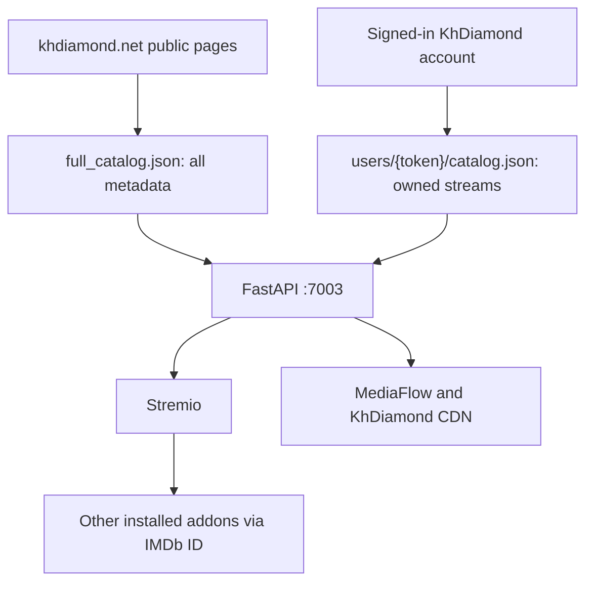
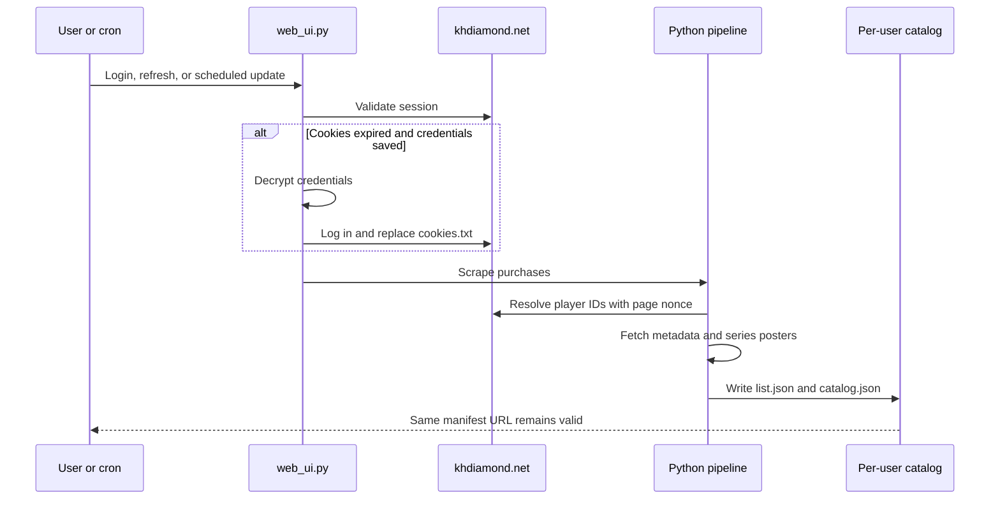
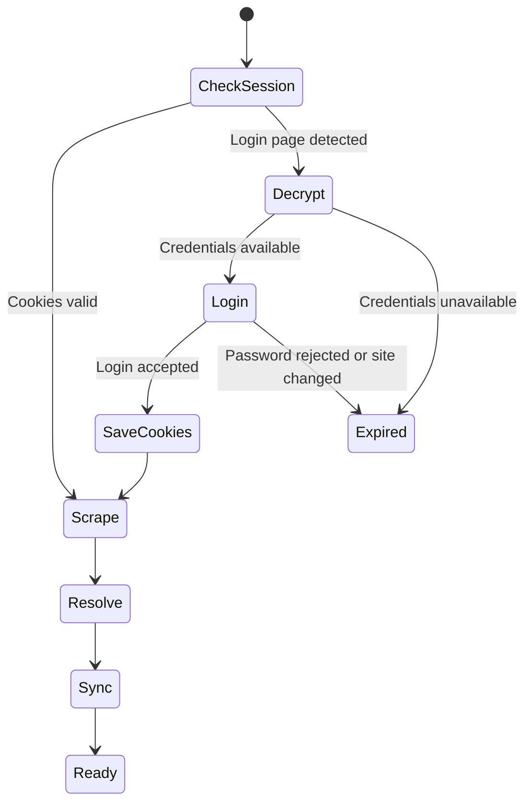

# KhDiamond Stremio UI

A self-hosted Stremio addon for [khdiamond.net](https://khdiamond.net). It
publishes the site's full public movie/series catalog with KhDiamond posters
and metadata, then unlocks KhDiamond streams only when the installed user's
account owns the requested title. Verified IMDb IDs let Stremio request streams
from this addon and every other installed addon for the same movie or episode.

The active deployment runs one FastAPI service on port `7003`, publishes it
through Cloudflare Tunnel, maintains one public metadata catalog plus an
isolated entitlement catalog for each user, and renews expired sessions from
encrypted saved credentials.

> This project is intended for access to content owned or authorized by each
> KhDiamond account. It does not bypass account access controls or purchases.

## Features

- Username/password login, pasted cookies, or uploaded Netscape `cookies.txt`
- Stable per-user Stremio manifest URLs
- Full public KhDiamond catalog for every installed user
- Shared IMDb IDs for cross-addon stream aggregation
- Safe KhDiamond-only IDs when an external match cannot be verified
- Encrypted credential storage for automatic session renewal
- Purchase scraping for movies and TV shows
- Episode expansion and current DooPlay nonce-aware player resolution
- Movie, series-derived, metadata, search, and stream resources for Stremio
- Correct parent-series poster lookup, including lazy-loaded poster images
- Up to 12 stream choices from quality, CDN, and MediaFlow combinations
- Daily public metadata and per-user entitlement refresh with atomic writes
- One FastAPI/systemd service; the legacy Node port `7002` is not required

## Active architecture



The public UI URL in the reference deployment is:

```text
https://khdiamond-ui.sudolocal.qzz.io
```

Each account receives a stable manifest URL:

```text
https://khdiamond-ui.sudolocal.qzz.io/u/{token}/manifest.json
```

Only port `7003` is required. `index.js` and port `7002` belong to the legacy
single-user Node deployment and can remain stopped.

## Pipeline



Pipeline stages:

1. `user_scrape.py` loads a user's cookies and extracts purchased movies and
   TV shows from the account page.
2. If the session has expired, it uses `khdiamond_credentials.py` to decrypt
   saved credentials, logs in, replaces the cookie jar, and retries once.
3. `user_resolve.py` expands TV shows into episodes, obtains each page's
   current DooPlay nonce, resolves player responses, and stores media IDs.
4. `user_sync.py` scrapes KhDiamond metadata, enriches it with TMDB data, uses
   the real parent-series slug for posters, and creates `catalog.json`.
5. `scrape_full_catalog.py` independently builds public metadata for every site
   title. Cache entries include the current title/type/page fingerprint so a
   reused opaque slug cannot retain an old movie's identity.
6. `web_ui.py` serves public catalog/meta records, then maps stream requests to
   the signed-in user's owned page slug or episode URL.

### Identity and entitlement rules

| Situation | Stremio ID | KhDiamond stream |
|---|---|---|
| Confident TMDB/IMDb match | `tt...` | Returned only if the user's catalog contains the same current KhDiamond page |
| No safe external match | `khdcat_{slug}` | Returned only if owned; other addons cannot merge this custom ID |
| Full-catalog title not owned | IMDb or KhDiamond ID | Empty KhDiamond stream list; other addons may still respond to IMDb IDs |

The matcher uses the detail page's **original title**, year, and a strict
similarity threshold. A missing IMDb ID is deliberately preferred over a
wrong IMDb ID.

## Stream matrix

Each title can return up to 12 streams:

| Quality | CDN targets | MediaFlow targets | Maximum |
|---|---:|---:|---:|
| 2160p, when available | 2 | 2 | 4 |
| 1080p | 2 | 2 | 4 |
| 720p | 2 | 2 | 4 |

The addon returns stream URLs but does not proxy video bytes itself. Playback
travels through a configured MediaFlow instance to a KhDiamond HLS CDN.

## Repository layout

| Path | Purpose |
|---|---|
| `web_ui.py` | FastAPI setup UI and Stremio HTTP API on port `7003` |
| `khdiamond_http.py` | Shared HTML, nonce, post-ID, response, and media-ID parsing |
| `khdiamond_credentials.py` | Fernet encryption and automatic KhDiamond login |
| `user_scrape.py` | Per-user purchased-library scraper |
| `user_resolve.py` | Episode expansion and player/media-ID resolver |
| `user_sync.py` | Metadata, poster, TMDB, and catalog generator |
| `scrape_full_catalog.py` | Public metadata scraper with source-aware cache and strict TMDB matching |
| `scripts/audit_full_catalog.py` | Identity, poster, custom-ID, and duplicate-ID coverage report |
| `daily_update.sh` | Locked public-catalog and per-user daily update |
| `update_all_users.sh` | Refreshes every valid directory under `users/` |
| `test_khdiamond_http.py` | Scraping and player-response regression tests |
| `test_khdiamond_credentials.py` | Credential encryption and permission tests |
| `test_full_catalog.py` | Cache identity and TMDB-confidence regression tests |
| `test_web_ui_catalog.py` | Public metadata/private entitlement integration tests |
| `index.js` | Optional legacy single-user Node addon on port `7002` |
| `server_*.py`, `sync_catalog.py` | Optional legacy Google Sheets pipeline |

## Per-user storage

Each account is isolated under `/root/khdiamond/users/{token}/`:

| File | Contents |
|---|---|
| `cookies.txt` | Netscape cookie jar used for authenticated requests |
| `credentials.enc` | Fernet-encrypted username and password, login mode only |
| `library_raw.json` | Purchased movies and parent TV shows |
| `list.json` | Resolved media IDs and parent-series slugs |
| `catalog.json` | Final data served to Stremio |
| `meta_cache.json` | Metadata cache keyed by media ID |
| `pipeline.log` | Interactive pipeline output |
| `running.txt` | Build-in-progress marker |
| `error.txt` | Pipeline failure marker |
| `expired.txt` | Authentication renewal failure marker |

The encryption master key is stored outside user directories at
`/root/khdiamond/credential.key` by default.

Shared public state is stored separately:

| File | Contents |
|---|---|
| `/root/khdiamond/full_catalog.json` | Atomically published metadata used by catalog/meta endpoints |
| `/root/khdiamond/full_catalog_cache.json` | Source fingerprint and enrichment cache; never served directly |

## Requirements

- Linux server with Python 3.12+
- `python3-venv`, `flock`, systemd, and Cloudflared
- A TMDB API bearer token for metadata enrichment
- One or two MediaFlow instances
- A KhDiamond account with authorized purchases
- DNS hostname routed to a Cloudflare Tunnel

The port-7003 profile does not require Node.js, PM2, Google Sheets, or a
Cloudflare Worker.

## Installation

### 1. Clone and create a virtual environment

```bash
git clone https://github.com/iamsherman1234/khdiamond-stremio-addon.git /root/khdiamond
cd /root/khdiamond

apt-get update
apt-get install -y python3-venv
python3 -m venv .venv
.venv/bin/pip install --upgrade pip
.venv/bin/pip install -r requirements.txt
```

Using a virtual environment avoids Debian/Ubuntu's PEP 668
`externally-managed-environment` error.

### 2. Configure the systemd environment

Create `/root/khdiamond/khdiamond.env`:

```dotenv
KH_DIAMOND_UI_BASE=https://khdiamond-ui.example.com
KH_DIAMOND_CREDENTIAL_KEY_FILE=/root/khdiamond/credential.key
TMDB_ACCESS_TOKEN=replace_with_tmdb_bearer_token
MEDIAFLOW_URL=https://mediaflow-primary.example.com
MEDIAFLOW_URL2=https://mediaflow-fallback.example.com
MEDIAFLOW_PASSWORD=replace_with_mediaflow_password
FULL_CATALOG_PATH=/root/khdiamond/full_catalog.json
```

Protect it:

```bash
chmod 600 /root/khdiamond/khdiamond.env
```

Do not put quotes around values unless the quote characters are part of the
actual value. A systemd `EnvironmentFile` also does not use `export`.

### 3. Install the UI service

Create `/etc/systemd/system/khdiamond-ui.service`:

```ini
[Unit]
Description=KhDiamond Multi-User Stremio Addon
After=network-online.target
Wants=network-online.target

[Service]
Type=simple
User=root
WorkingDirectory=/root/khdiamond
EnvironmentFile=/root/khdiamond/khdiamond.env
Environment="PATH=/root/khdiamond/.venv/bin:/usr/local/sbin:/usr/local/bin:/usr/sbin:/usr/bin"
ExecStart=/root/khdiamond/.venv/bin/python /root/khdiamond/web_ui.py
Restart=always
RestartSec=5

[Install]
WantedBy=multi-user.target
```

Enable it:

```bash
systemctl daemon-reload
systemctl enable --now khdiamond-ui
systemctl is-active khdiamond-ui
curl -fsS -o /dev/null -w 'HTTP %{http_code}\n' http://127.0.0.1:7003/
```

Expected result: `active` and `HTTP 200`.

### 4. Configure Cloudflare Tunnel

Add an ingress rule to the configuration used by the Cloudflared systemd
service:

```yaml
ingress:
  - hostname: khdiamond-ui.example.com
    service: http://localhost:7003
  - service: http_status:404
```

The catch-all `http_status:404` rule must remain last. Validate the same file
that systemd loads:

```bash
systemctl cat cloudflared | grep ExecStart
cloudflared tunnel --config /etc/cloudflared/config.yml ingress validate
systemctl restart cloudflared
curl -fsS -o /dev/null -w 'HTTP %{http_code}\n' https://khdiamond-ui.example.com/
```

Backup hostnames may point to the same port by adding more hostname/service
pairs before the catch-all rule.

### 5. Create the cron environment

Create `/root/khdiamond/cron_env.sh` with the variables needed by the metadata
and stream pipeline:

```bash
export TMDB_ACCESS_TOKEN='replace_with_tmdb_bearer_token'
export MEDIAFLOW_URL='https://mediaflow-primary.example.com'
export MEDIAFLOW_URL2='https://mediaflow-fallback.example.com'
export MEDIAFLOW_PASSWORD='replace_with_mediaflow_password'
export KH_DIAMOND_CREDENTIAL_KEY_FILE='/root/khdiamond/credential.key'
```

Protect it and install the daily schedule:

```bash
chmod 600 /root/khdiamond/cron_env.sh
chmod +x /root/khdiamond/daily_update.sh /root/khdiamond/update_all_users.sh
crontab -e
```

Add:

```cron
0 0 * * * /root/khdiamond/daily_update.sh
```

This runs at midnight in the server's local timezone. `daily_update.sh` uses
`flock` so a second scheduled run cannot overlap the first. It rebuilds the
local public catalog first and then refreshes per-user entitlements. It does
not upload to a Cloudflare Worker or KV namespace.

### 6. Build the first public catalog

Run this before installing the manifest so all site titles are available:

```bash
cd /root/khdiamond
source cron_env.sh
python3 scrape_full_catalog.py
python3 scripts/audit_full_catalog.py
```

The first run intentionally invalidates legacy cache entries that lack a
source fingerprint. Later runs reuse unchanged entries and complete faster.

## Creating an addon

1. Visit `https://khdiamond-ui.example.com/`.
2. Choose **Login**, **Paste Cookies**, or **Upload File**.
3. Login mode encrypts and stores the credentials for automatic renewal.
4. Wait for scrape, resolution, and metadata synchronization to finish.
5. Copy the generated `/u/{token}/manifest.json` URL into Stremio.

Typical build time is 5–10 minutes, depending on library size and remote API
latency. The status page refreshes while the pipeline is running.

## Automatic authentication renewal



For accounts created or refreshed with username/password:

- `credentials.enc` contains the encrypted login.
- `credential.key` is generated once with mode `600`.
- On expiration, `user_scrape.py` decrypts, logs in, saves fresh cookies, and
  retries the account request.
- The token and installed Stremio URL do not change.
- If renewal fails, `expired.txt` is written and the refresh page requests new
  credentials. Scheduled updates keep the previous working catalog.

Accounts created from pasted/uploaded cookies do not have saved credentials
and therefore require manual cookie replacement after expiration.

### Security limitations

Encryption protects credentials from accidental disclosure and prevents the
password from appearing directly in backups or directory listings. Because
the application and encryption key are on the same server, a root compromise
can decrypt every stored account. Use full-disk encryption, restrict SSH, keep
the system patched, and do not expose server administration services publicly.

Back up `credential.key` securely. Losing it makes every `credentials.enc`
file unrecoverable. Never commit the key, user directories, environment files,
cookies, archives, or logs.

## Stremio API

For a token named `{token}`:

| Resource | Path |
|---|---|
| Manifest | `/u/{token}/manifest.json` |
| Movie catalog | `/u/{token}/catalog/movie/khdiamond_movies_{token}.json` |
| Series catalog | `/u/{token}/catalog/series/khdiamond_series_{token}.json` |
| Metadata | `/u/{token}/meta/{type}/{id}.json` |
| Streams | `/u/{token}/stream/{type}/{id}.json` |

Responses include permissive CORS headers because Stremio clients must access
the addon remotely. A token acts like an unlisted URL; do not post manifest
URLs publicly.

Catalog and meta responses read `full_catalog.json`. Stream responses read the
user's private `users/{token}/catalog.json`. This split is what allows all site
posters to appear without granting streams the account has not purchased.

## Operations

### Service health

```bash
systemctl is-active khdiamond-ui cloudflared
ss -ltnp | grep ':7003'
curl -fsS -o /dev/null -w 'HTTP %{http_code}\n' \
  https://khdiamond-ui.example.com/
```

`curl -I` sends `HEAD`, which the root FastAPI route does not implement and may
return HTTP 405. Use the normal GET-based command above.

### Pipeline monitoring

```bash
pgrep -af 'user_(scrape|resolve|sync)\.py'
tail -f /root/khdiamond/users/{token}/pipeline.log
journalctl -u khdiamond-ui -n 100 --no-pager
```

### Scheduled-update logs

```bash
tail -n 100 /var/log/khdiamond_daily.log
tail -n 100 /var/log/khdiamond_users.log
```

### Manual update for all users

```bash
/root/khdiamond/daily_update.sh
```

### Manual update for one user

```bash
cd /root/khdiamond
source cron_env.sh
export USER_TOKEN='{token}'
export USER_DIR="/root/khdiamond/users/$USER_TOKEN"
export COOKIES_PATH="$USER_DIR/cookies.txt"
export CATALOG_PATH="$USER_DIR/catalog.json"

python3 user_scrape.py &&
python3 user_resolve.py &&
python3 user_sync.py
```

The `&&` operators prevent later stages from running against stale input after
an earlier failure.

### Removing a user

Stop any pipeline for the exact token, verify the directory, and then remove
only that user's directory. This permanently removes its cookies, encrypted
credentials, catalog, cache, and logs. Never use a wildcard against
`/root/khdiamond/users` for administrative deletion.

## Verification

Run the local regression and syntax checks:

```bash
cd /root/khdiamond
python3 -m unittest -v \
  test_khdiamond_http.py test_khdiamond_credentials.py \
  test_full_catalog.py test_web_ui_catalog.py
python3 -m py_compile \
  khdiamond_http.py khdiamond_credentials.py \
  user_scrape.py user_resolve.py user_sync.py web_ui.py \
  scrape_full_catalog.py scripts/audit_full_catalog.py
bash -n daily_update.sh update_all_users.sh
```

Verify a deployed catalog:

```bash
TOKEN='{token}'
BASE='https://khdiamond-ui.example.com'

curl -fsS -o /dev/null -w 'Manifest HTTP %{http_code}\n' \
  "$BASE/u/$TOKEN/manifest.json"

curl -fsS "$BASE/u/$TOKEN/catalog/movie/khdiamond_movies_$TOKEN.json" |
  python3 -c 'import json,sys; print("Movies:", len(json.load(sys.stdin).get("metas", [])))'

curl -fsS "$BASE/u/$TOKEN/catalog/series/khdiamond_series_$TOKEN.json" |
  python3 -c 'import json,sys; x=json.load(sys.stdin).get("metas", []); print("Series posters: {}/{}".format(sum(bool(i.get("poster")) for i in x), len(x)))'

python3 scripts/audit_full_catalog.py
```

## Troubleshooting

### Status page stays on Building

```bash
pgrep -af 'user_(scrape|resolve|sync)\.py'
tail -n 50 /root/khdiamond/users/{token}/pipeline.log
find /root/khdiamond/users/{token} -maxdepth 1 -type f -printf '%f\n'
```

`running.txt` without a matching process indicates an interrupted build. Read
the pipeline log before removing stale state or starting another pipeline.

### HTTP 400 from the player endpoint

The current DooPlay endpoint requires the per-page nonce. Confirm the deployed
`user_resolve.py` imports `extract_nonce` from `khdiamond_http.py`. Repeated
HTTP 400 responses can also mean the KhDiamond session is invalid.

### Cookies expired

For login-mode users, look for `Session expired — attempting encrypted
automatic login` in the pipeline log. If renewal fails, visit:

```text
https://khdiamond-ui.example.com/refresh/{token}
```

Enter the current username/password to replace both encrypted credentials and
cookies while preserving the same token.

### Series posters are blank

Confirm `list.json` preserves a non-empty `series` field for episode rows and
that the public series catalog reports poster URLs. If an old cache predates
the fix, move `meta_cache.json` aside and run the resolver and sync again.

### Catalog works but Stremio still shows old metadata

Verify the public API first. If poster URLs are present there, restart Stremio
or remove and reinstall the addon to clear client-side cached metadata.

### Wrong title or IMDb ID after an opaque slug was reused

The cache must contain `_cache_version: 3` and a `_source_signature`. Deploy
the current scraper and run it once. Do not copy old IMDb IDs into manual
overrides unless the match has been verified. The audit script reports
duplicate IMDb IDs; unmatched items safely use `khdcat_...` IDs.

### Port or tunnel errors

```bash
systemctl is-active khdiamond-ui cloudflared
ss -ltnp | grep ':7003'
cloudflared tunnel --config /etc/cloudflared/config.yml ingress validate
```

Validate the configuration path shown in Cloudflared's systemd `ExecStart`,
not an unused configuration under another directory.

## Optional legacy components

The repository retains code for earlier deployments:

- `index.js` serves a local JSON catalog on port `7002`.
- `server_scrape.py`, `server_resolve.py`, and `sync_catalog.py` use Google
  Sheets for a single-user pipeline.
- `khdiamond-worker` can provide a Cloudflare Worker streaming endpoint.
- `khdiamond-catalog-worker` can provide a separate public full catalog, but
  the active port-7003 profile reads the local `full_catalog.json` directly.

They are not started, routed, or updated by the UI-only deployment described
here. Their directories may remain as inactive backups.

## License and responsibility

Use this software only with accounts and media you are authorized to access.
The operator is responsible for securing credentials, complying with
KhDiamond's terms, and controlling access to the deployed addon.
